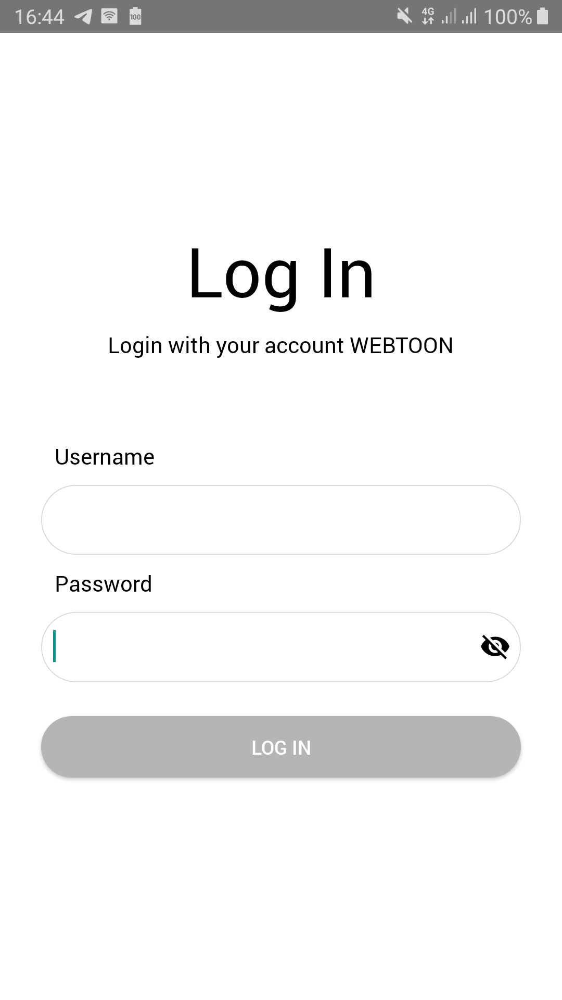
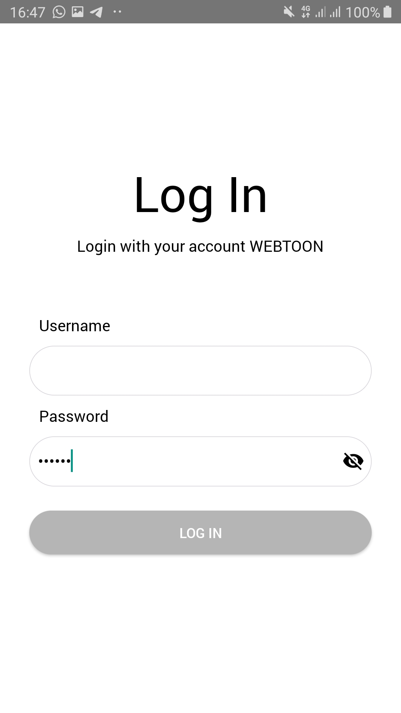
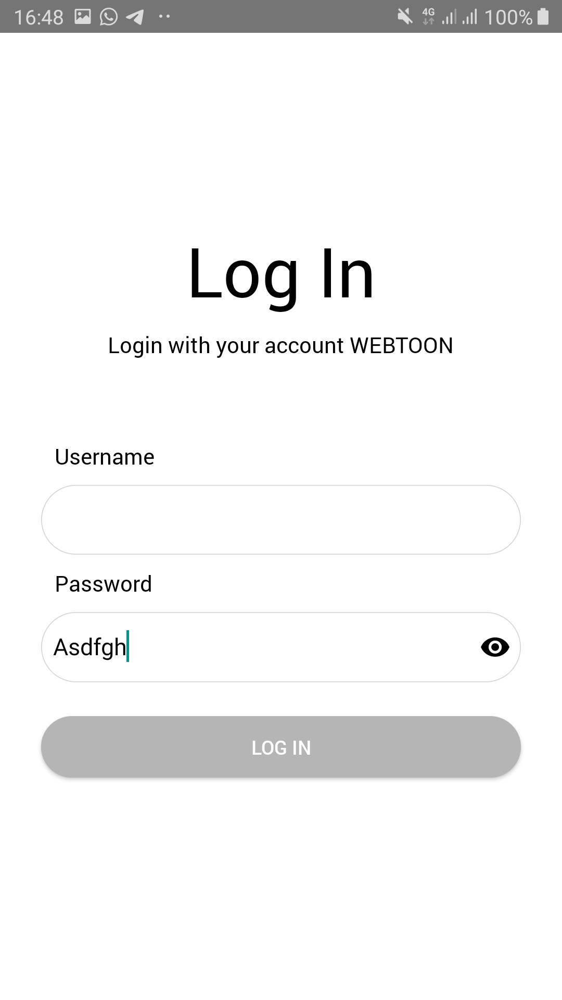
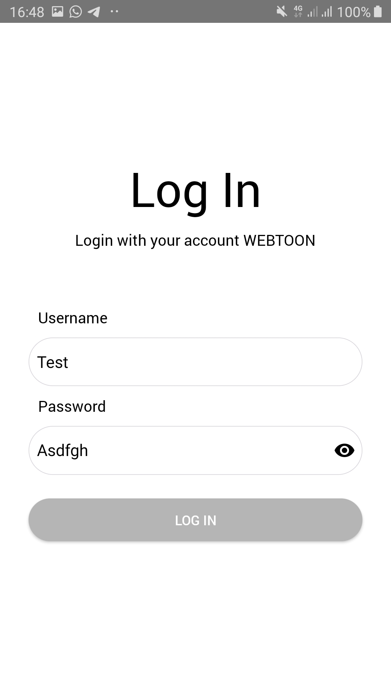
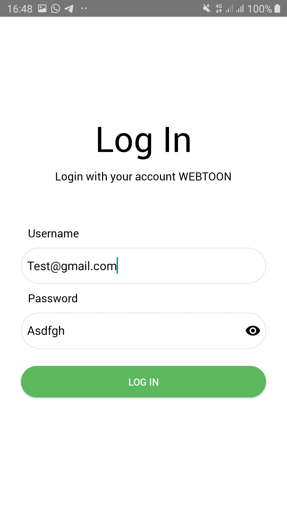

# Screenshot

Tampilan Awal

 

Password tidak terlihat

 

Ketika icon eye ditekan, password terlihat

 

button disable ketika username bukan berupa format alamat email

button enable ketika username berformat alamat email 

