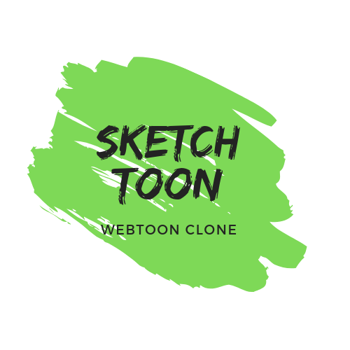

<h1 align="center">
   
</h1>

## Important
This project is still on very early development stage. If you want to use for production, use it with your own risk.
 More feature Coming Really Soon.

## Sketchtoon
Inspired by Webtoon, Sketchtoon is an app that let you Explore million titles of comics, create your own comics, and share comics with your beloved friends.

## Screenshots

  
  

## Features
* Explore million titles of comics and manga from sketchtoon database
* Create your favourite collection
* Create your own Sketchtoon
* Share Sketchtoon with your friend

## Why Sketchtoon?
* It's Free
* Simple Usage
* It's React Native, so it support android & iOS by default!
* Simple Code, so you can easily contribute on it.

## Tech Stack
* React Native for the Mobile Frontend
* Express.Js as the Backend

## Contact 
* WA: +62 895 3584 86068
* email: syaiful919@gmail.com
* LinkedIn: bit.ly/syaifulsalam

